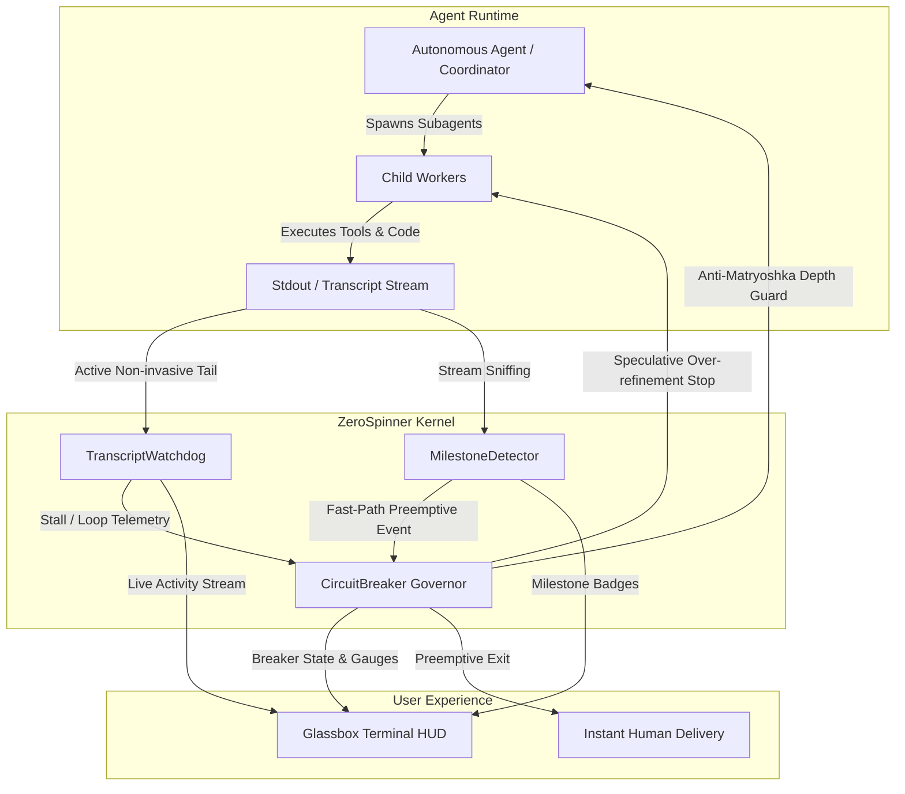

# ZeroSpinner

[](https://pypi.org/project/zerospinner/)
[](https://www.python.org/)
[](https://opensource.org/licenses/MIT)
[](https://github.com/jdymitarai/zerospinner)
[](https://modelcontextprotocol.io/)
[](https://m8ven.ai/mcp/jdymitarai-zerospinner-tf866w?s=readme)

> **The Preemptive Kernel & Circuit Breaker for Autonomous AI Agents.**  
> *Eliminate the infinite spinner. Intercept recursive over-refinement. Deliver the second milestones pass.*

---

## 🚨 The Infinite Spinner Anti-Pattern

Modern autonomous AI coding agents (Claude Code, Antigravity, Devin, LangGraph, MetaGPT) frequently suffer from the **Infinite Spinner Dilemma**:

1. **The Matryoshka Spawning Trap**: A coordinator agent spawns a worker, which spawns an improvement agent, which spawns a reviewer, which spawns a linter. The human stares helplessly at a spinning UI loader while execution depth spirals out of control.
2. **Speculative Over-Refinement**: The core engineering goal (e.g. `tests passed`, `PR created`, `build succeeded`) was completed in 45 seconds. However, secondary improvement loops keep spinning for another 10 minutes performing speculative, microscopic polish that adds zero business value.
3. **Blackbox Stall Deadlocks**: Tool calls freeze on network hangs or process locks, while the terminal outputs nothing and leaves the operator guessing.

**ZeroSpinner** solves this by acting as a non-invasive preemptive kernel between the agent, the runtime process, and the human developer.

---

## 🌟 Key Capabilities

- 🎯 **Preemptive Milestone Engine**: Scans stdout streams and JSONL transcripts using high-speed heuristics for key milestones (`MILESTONE_TESTS_PASSED`, `MILESTONE_PR_CREATED`, `MILESTONE_BUILD_SUCCESS`, `MILESTONE_COMMIT_PUSHED`). Dispatches immediate notifications without waiting for the full multi-turn cycle to complete.
- 🛑 **Anti-Matryoshka Circuit Breaker**: Enforces strict subagent nesting depth (`max_depth`), token limits, and time budgets. When a core milestone is reached, speculative secondary polishers are intercepted immediately (`TRIP_STOP_AND_DELIVER`) with auto-termination of child processes.
- 🐕 **Active Transcript Watchdog**: Non-invasively tails JSONL transcripts and process streams to detect tool-call stalls and repetitive loop deadlocks.
- ⏱️ **60-Second Active Heartbeat Telemetry**: Automatically aggregates and outputs a comprehensive telemetry status report every 60 seconds, displaying processing velocity (lines/min), intercepted speculative cycles, estimated token and dollar savings, circuit breaker health, and Jules cloud microVM states.
- 🪟 **Glassbox Terminal HUD**: High-contrast, Rich-based terminal dashboard replacing the empty spinner with real-time agent hierarchy trees, milestone badges, telemetry gauges, and live activity streams.
- 🔌 **Standard MCP Server**: Native Model Context Protocol (MCP) server supporting both `mcp` 2.x and legacy FastMCP with complete boolean tool annotations (`readOnlyHint`, `destructiveHint`, `idempotentHint`, `openWorldHint`).

---

## 🏛?Architecture



---

## 🚀 Quickstart

### 1. Installation

```bash
# Clone and install in editable mode
git clone https://github.com/jdymitarai/zerospinner.git
cd zerospinner
pip install -e .

# Or with optional MCP server support
pip install -e ".[mcp]"
```

### 2. Interactive Simulation Demo

Experience how ZeroSpinner stops recursive subagent loops and triggers instant delivery:

```bash
zspin demo
```

*(Add `--fast` for quick automated validation, or `--headless` for plain ASCII outputs).*

### 3. Supervise Any Agent or Command

Wrap existing tools, tests, or agents with the Glassbox HUD and circuit breaker:

```bash
# Wrap a test run
zspin run -- pytest tests/

# Wrap an autonomous agent CLI with depth and time bounds
zspin run --max-depth 2 --time-budget 300 -- claude "Fix issue #42"
```

### 4. Watch an Active Agent Session

Tail an active JSONL transcript in real-time with full telemetry:

```bash
zspin watch ~/.claude/transcripts/session-latest.jsonl --poll 1.0
```

---

## 🔌 Model Context Protocol (MCP) Integration

ZeroSpinner includes a standard FastMCP server that connects directly with Claude Desktop, Cursor, or Antigravity.

### MCP Configuration (`claude_desktop_config.json`)

```json
{
  "mcpServers": {
    "zerospinner": {
      "command": "zspin",
      "args": ["mcp"]
    }
  }
}
```

### Exposed MCP Tools

| Tool | Parameters | Annotations / Hints | Description |
| :--- | :--- | :--- | :--- |
| `zerospinner_watch_session` | `transcript_path`, `poll_interval` | `idempotentHint` | Attaches active watchdog to tail agent JSONL transcript for stalls and loops. |
| `zerospinner_emit_milestone` | `type`, `payload`, `source` | *Standard Action* | Preemptively emits milestone event (`TESTS_PASSED`, `PR_CREATED`) to trigger early exit. |
| `zerospinner_status` | *None* | `readOnlyHint`, `idempotentHint` | Queries circuit breaker state, active subagents, milestones, and telemetry. |
| `zerospinner_trip_breaker` | `reason` | `destructiveHint`, `idempotentHint` | Manually trips the circuit breaker to kill child workers and force delivery. |
| `zerospinner_teardown` | `stop_cloud`, `reason` | `destructiveHint`, `idempotentHint` | Completely terminates background subagents, cleans PID flags, and halts cloud compute. |

---

## 🐍 Python SDK API Reference

Embed ZeroSpinner directly inside your custom agentic pipelines (LangGraph, AutoGen, CrewAI):

```python
from zerospinner.core import (
    MilestoneDetector,
    CircuitBreaker,
    MILESTONE_TESTS_PASSED,
    MILESTONE_PR_CREATED,
)

# 1. Initialize Kernel Components
detector = MilestoneDetector()
breaker = CircuitBreaker(
    max_depth=2,                 # Disallow subagents beyond depth 2
    time_budget_sec=300.0,       # Max 5 minutes total
    stop_on_core_milestone=True, # Preempt speculative polish once tests/PR pass
)

# Auto-wire detector to breaker
detector.on_milestone(breaker.record_milestone)

# 2. Fast-Path Preemptive Notification Callback
detector.on_milestone(lambda event: print(f"?FAST-PATH ALERT: {event.milestone_type}"))

# 3. Supervise Subagent Spawns
allowed, err = breaker.register_subagent(
    agent_id="subagent-42",
    parent_id="root-coord",
    role="coding_worker",
)
if not allowed:
    print(f"Governor Intercepted: {err}")

# 4. Feed Output Chunks
detector.scan_chunk("================= 24 passed in 0.81s =================")

# 5. Check Breaker State
if breaker.is_tripped():
    print(f"Breaker tripped: {breaker.trip_reason} -> Deliver immediately!")
```

---

## 🧪 Comprehensive Verification Suite

Run the full unit and integration test suite:

```bash
pytest tests/ -v
```

All 36 tests cover:
- Pytest, Cargo, Jest, Go, and Python unittest regex matching
- Fast-path preemptive callback dispatch and exception isolation
- Transcript tailing and partial JSON buffer assembly
- Tool-call stall timeouts and repetitive loop deadlocks
- Anti-Matryoshka depth limiting and speculative over-refinement trips
- Child process termination under Windows (`taskkill`) and POSIX (`SIGTERM`)
- Rich Glassbox HUD rendering and MCP tool invocations

---

## 📄 License

ZeroSpinner is licensed under the [MIT License](LICENSE).
